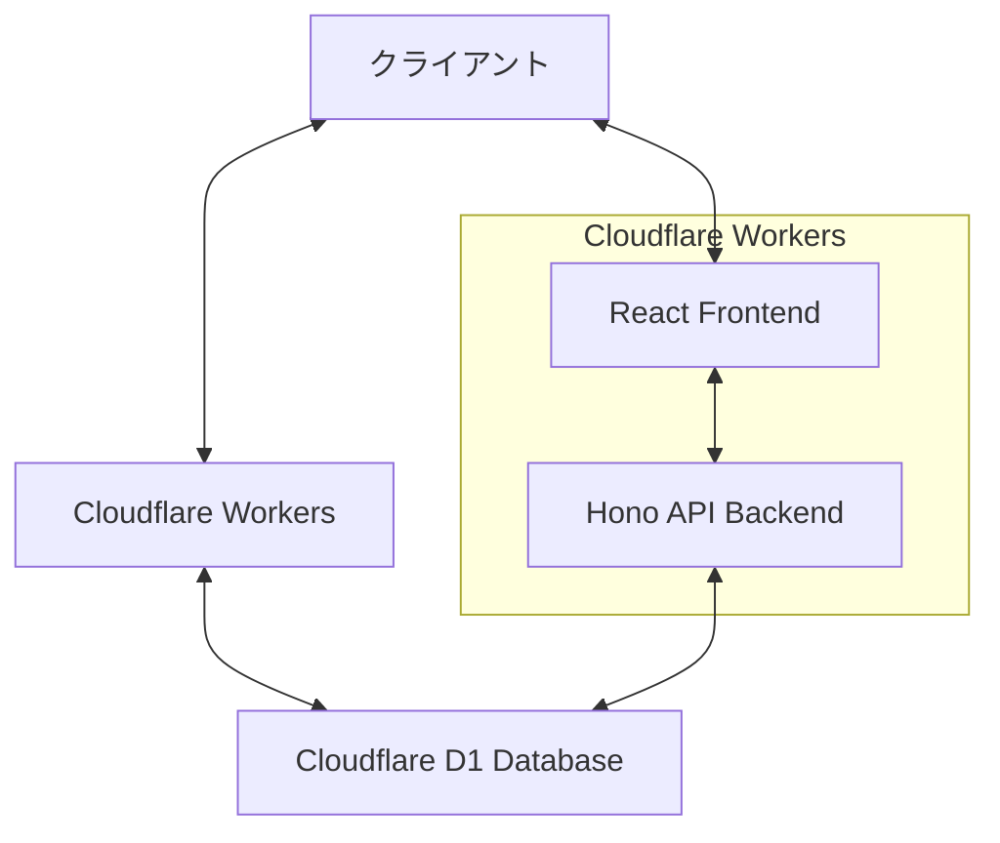
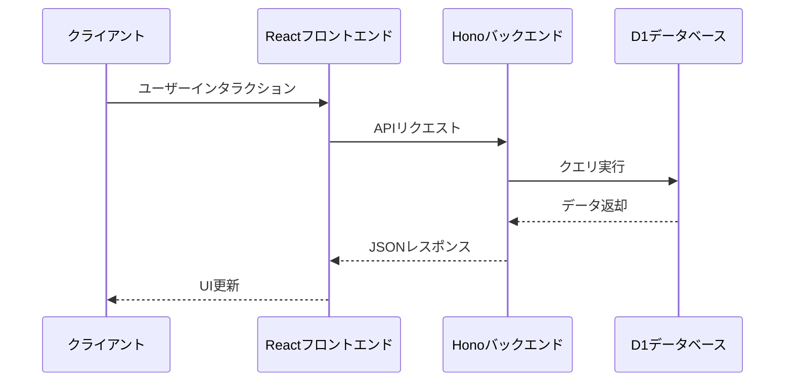
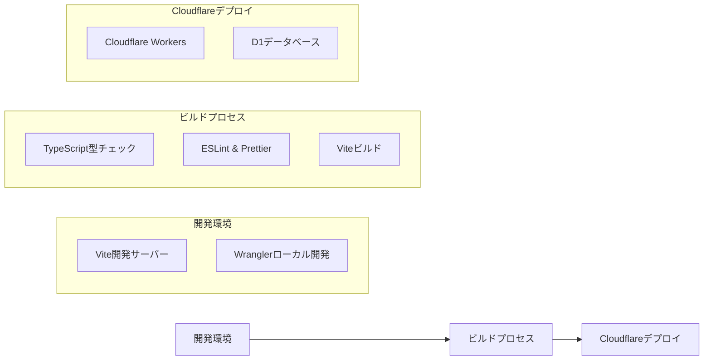

# システムパターン (System Patterns)

## アーキテクチャ概要

Magrevは、Cloudflare Workersプラットフォーム上に構築されたフルスタックウェブアプリケーションで、以下の主要コンポーネントで構成されています：

## 主要コンポーネント

### フロントエンド
- **技術**: React 19, Vite
- **構造**: シングルページアプリケーション（SPA）
- **エントリーポイント**: `src/frontend/main.tsx`
- **主要コンポーネント**: `App.tsx`（メインアプリケーションコンポーネント）
- **スタイリング**: CSS（`app.css`, `index.css`）

### バックエンド
- **技術**: Cloudflare Workers, Hono
- **エントリーポイント**: `src/backend/index.ts`
- **APIルート**:
  - `GET /api/ping`: 基本的な応答を返す
  - `GET /api/user`: ユーザー一覧を取得
  - `POST /api/user`: 新しいユーザーを作成

### データベース
- **技術**: Cloudflare D1（SQLiteベース）
- **ORM**: Drizzle ORM
- **スキーマ**: `src/backend/db/schema.ts`
- **テーブル**:
  - `users`: ユーザー情報を格納（`id`, `name`）

## データフロー

## デプロイメントモデル

## 設計パターン

現時点では、アプリケーションは基本的な構造のみを持っており、複雑な設計パターンは実装されていません。以下は現在使用されている基本的なパターンです：

1. **クライアント-サーバーパターン**: フロントエンドとバックエンドの明確な分離
2. **RESTful API**: HTTPメソッドを使用したリソース操作
3. **ORMパターン**: Drizzle ORMを使用したデータベースアクセスの抽象化

## 技術的な決定事項

1. **Cloudflare Workersの採用**: エッジコンピューティングの利点を活かすため
2. **Honoフレームワークの使用**: 軽量で高速なAPIフレームワークとして
3. **Drizzle ORMの採用**: TypeScriptとの統合が優れたORMとして
4. **Reactの使用**: コンポーネントベースのUIフレームワークとして

## 将来的な拡張ポイント

1. **認証システム**: ユーザー認証の実装
2. **状態管理**: より複雑なフロントエンド状態管理の導入
3. **テスト戦略**: ユニットテスト、統合テスト、E2Eテストの実装
4. **CI/CD**: 継続的インテグレーション/デプロイメントパイプラインの強化
